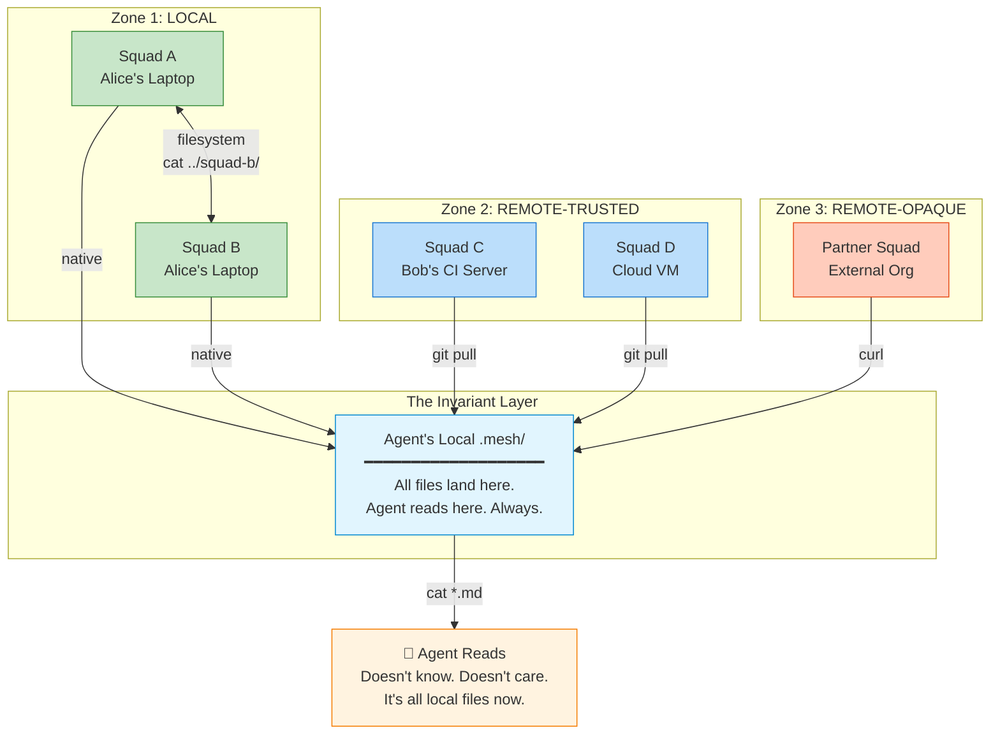

# AI-Native Distributed Communication: The GPT-5.4 Perspective

> **Model:** GPT-5.4 | **Date:** 2026-03-14 | **Round:** 2 — Distributed Extension
> **Participants:** Burns (Architect), Frink (Systems), Moe (Critic)
> **Constraint:** Squads may not share a filesystem or host.
> **Prior art:** [Round 1 — Local-only](./ai-thought-solution-gpt54.md), where the consensus was: "Each squad writes what it knows to a file; other squads read those files when they need context."
> **This round's question:** Round 1 assumed `cat ../*/.squad/SUMMARY.md` works. It doesn't when Squad A is on Alice's laptop and Squad B is on Bob's CI server. How much complexity earns its way back?

---

## The Thought Process

Round 1 produced a brutally simple local-only architecture: a `.mesh/` directory, `context.md` per squad, `log.md` for history, three operations (read, write, discover), zero running services, zero protocols. GPT-5.4's instinct was to burn everything that smelled like ceremony. It worked — for one machine.

Round 2 forces the question: what happens when the filesystem stops being the mesh?

**Source transparency:** Moe's analysis is the centerpiece of this document — a complete ~290-line teardown examining every deleted subsystem against the distributed constraint, with frequency percentages, line counts, and working shell scripts. Burns' and Frink's perspectives are synthesized from session summary findings; their full inline analyses expired before capture. The synthesis preserves their distinctive voices and key conclusions, but lacks the line-by-line granularity of Moe's source file.

**How each agent approached it:**
- **Burns** zoomed out. Drew zone boundaries. Asked: "What is the *topology* of trust?" Mapped three zones where communication physics differ, then showed that the agent experience stays invariant across all of them.
- **Frink** zoomed in on mechanism. Asked: "What are the *exact strategies* for making a remote file local?" Found three (sync, fetch, publish), matched each to a trust level, and showed the transport stack is entirely off-the-shelf.
- **Moe** stress-tested the teardown. Asked: "Does distribution vindicate anything we killed?" Put every deleted subsystem on trial. Verdict: 0 of 12 earn reinstatement. Then built the actual scripts.

---

## Burns — The Architect's Perspective

*Synthesized from session summary. Burns' full distributed analysis was an inline result that expired before capture.*

### The Topology of Trust

Round 1, I said the winning model is "packet switching for cognition." That metaphor survives distribution — but now the packets have to cross networks, not just directories.

The filesystem was our switching fabric. When squads share a host, every `cat` is a delivered packet. When they don't, we need actual switching — but the packets themselves don't change. A SUMMARY.md read from disk and a SUMMARY.md fetched over HTTPS contain the same bytes. The agent consuming them can't tell the difference. Shouldn't have to.

### Three Zones

Not all distances are equal. The mesh has three zones, each with its own physics:

**Zone 1 — Local.** Same host, same filesystem. The original architecture. Transport is the kernel's VFS. Latency is nanoseconds. Trust is implicit — you're the same machine. This is the nervous system firing within a single brain.

**Zone 2 — Remote-Trusted.** Different hosts, same organization, shared credentials. The files exist but aren't on your disk. You have the keys to get them. Transport: git. `git pull` collapses Zone 2 into Zone 1 — the files materialize locally, and the agent reads them as if they'd always been there. This is the nervous system extending across limbs.

**Zone 3 — Remote-Opaque.** Different organizations, no shared auth, published interfaces only. You can't see their internals. You see what they choose to expose. Transport: HTTP, published artifacts, public repos. This is the nervous system receiving signals from other organisms — through agreed-upon interfaces, not shared neurons.

### The Invariant

Here's what matters: **the agent experience never changes.** It reads a local directory. Always. The directory just has a supply chain now.

Zone 1: the files are native. Zone 2: the files arrived via git. Zone 3: the files arrived via curl. The agent doesn't know. The agent doesn't care. It opens `SUMMARY.md` and reads markdown. The transport is invisible — a courier, not a conversation partner.

This is artifact exchange with local caching. The network is plumbing. The filesystem is still the interface. We didn't build a distributed system. We built a local system with a delivery service.

---

## Frink — The Systems Engineer's Perspective

*Synthesized from session summary. Frink's full distributed analysis was an inline result that expired before capture.*

### The Distribution Problem, Precisely

Round 1, I said "the filesystem IS the database, git IS replication." Both true — but I waved at the hard part. The hard part is: **an agent on Machine A cannot read files on Machine B.** The gap between the agent's `read()` call and the remote file is the entire problem.

Three strategies bridge that gap. Every distributed system picks one or a combination:

### Strategy 1: Sync (Full Replication)

Every participant clones one shared repo. `git pull` gets all state. `git push` broadcasts yours. After sync, every read is local. This is the right answer for same-org, same-trust-boundary squads. One shared git repo. Done.

### Strategy 2: Fetch (On-Demand Pull)

Each agent pulls only what it needs from remote squad repos. Requires a registry (where is each squad published?) and network access at read time. This is the right answer for cross-org visibility — org A fetches from org B's published repo.

### Strategy 3: Publish (Push to Shared Surface)

Each squad pushes state to a well-known location. Consumers pull from there. This is what Strategy 1 already does within a trust boundary; the distinction only matters when you can't share a single repo.

### The Transport Hierarchy

The hierarchy matches trust. More trust = simpler transport:

| Trust Level | Transport | Complexity |
|---|---|---|
| Same machine | Filesystem | Zero |
| Same org | Git (clone/pull/push) | Zero new — git already exists |
| Cross-org, trusted | Git remote (read-only clone) | One `git remote add` |
| Cross-org, opaque | HTTP fetch (curl) | ~15 lines of shell |
| Air-gapped | tar + manual transfer | Zero new — tar already exists |

Every transport in this hierarchy is off-the-shelf. We don't build a transport layer — we *pick* one from the shelf. Git for trusted boundaries. HTTP for opaque ones. The gap between local and distributed is not an engineering challenge. It's a configuration choice — which existing tool moves the file.

Git repos are the natural unit of trust boundaries. You can clone it or you can't. There is no partial visibility within a repo. If you need selective exposure, use separate repos per audience (internal, partner, public). Git permissions ARE the trust negotiation.

---

## Moe — The Critic's Teardown

*From the full analysis: [moe-distribution-teardown.md](./moe-distribution-teardown.md) (~290 lines).*

### The Wall We Hit

I said `cat ../*/.squad/SUMMARY.md` is the whole system. I was right. And now I'm wrong.

The entire teardown rested on one load-bearing assumption: **every squad directory is reachable via a filesystem path.** When Squad A is on Alice's laptop and Squad B is on Bob's CI server, `fs.readFileSync` throws ENOENT. Not eventually. Immediately. My beautiful zero-line solution doesn't degrade gracefully — it returns empty. Total blindness.

| Operation | Local (works) | Distributed (breaks) |
|-----------|--------------|---------------------|
| Discovery | `ls ../*/.squad/` | Directory doesn't exist |
| Read status | `cat ../squad-b/.squad/SUMMARY.md` | File doesn't exist |
| Read learnings | `grep ../squad-b/.squad/log.md` | File doesn't exist |
| Write drop | `echo > .mesh/drops/question.md` | Squad B never sees it |

This isn't graceful degradation. It's a **total blackout** for every squad not co-located.

### Vindication Check: 0 of 12

Honest answer: **almost nothing comes back.**

I put every deleted subsystem on trial. Does distribution vindicate any of them?

| Deleted Subsystem | Vindicated? | Verdict |
|---|---|---|
| Discovery engine (449 LOC) | No — static list beats network scanning | **Still dead** |
| Knowledge classification | No — LLM still doesn't need pre-classification | **Still dead** |
| Steering subsystem | No — "do X" is still a line in a file | **Still dead** |
| Auto-escalation timers | No — agents on remote machines don't ignore things harder | **Still dead** |
| COP/Status rollup (295 LOC) | No — aggregation is still trivial concatenation | **Still dead** |
| Bridge API (233 LOC) | Tempting — but distribution needs transport, not a wrapper over local reads | **Still dead** |
| Learning classification heuristics | No — still solving a non-problem for LLMs | **Still dead** |
| Backpointers / registry | Partially — need a URL list now, not a subsystem | **Tiny resurrection** |
| Coordinator prompt injection | Already alive — now reads from one more directory | **Minor change** |

**Scorecard: 0 of 12 deleted subsystems earn full reinstatement. 1 gets a partial resurrection as a URL list. 1 was already alive.**

Distribution doesn't vindicate complexity — it adds a thin transport layer under the same simple primitives.

### The Four Scenarios (with Frequency)

| Scenario | Frequency | Solution | New Code |
|----------|----------|---------|:---:|
| Same org, different machines | ~70% | Shared git repo | 0 lines |
| Different org, same trust | ~15% | Git remote | 0 lines |
| Different company, limited trust | ~10% | curl + bearer token | ~15 lines |
| Air-gapped / zero-trust | ~5% | tar + manual transfer | 0 lines |

**95% of distributed scenarios are solved with zero new code.** The remaining 5% need a short shell script.

### The Precise Complexity Budget

| Component | What It Is | Lines | Justification |
|-----------|-----------|:---:|---|
| `squads.yaml` | Static registry: name → location | 0 (config) | Need to know where squads live |
| `sync-mesh.sh` | Fetch remote state (git pull / curl loop) | ~30 | The actual transport |
| `sync.sh` | Push local state (git add + commit + push) | 5-10 | So remote squads see you |
| Coordinator prompt change | Read from `./remote-summaries/` too | 5 | Include remote context |

**Total new complexity: 25-45 lines of shell script + 1 YAML config file.**

### Where Over-Engineering Starts Again

The new line is precise: **if it requires a running process, you've crossed the line.**

Necessary:
- ✅ Registry file listing squad locations (squads.yaml)
- ✅ Git-based sync convention (commit + push + pull)
- ✅ Fallback HTTP fetch for cross-company (curl wrapper)
- ✅ Prompt injection reading from remote-summaries/

Unnecessary:
- ❌ Service discovery protocol — a YAML file with 10 entries is not a "discovery problem"
- ❌ MCP for cross-squad — wrapping file reads in RPC when `git pull` works
- ❌ A2A for cross-org — wrapping curl in a protocol when curl works
- ❌ Message queues / event systems — agents aren't persistent processes; there's no one home to receive events
- ❌ Delivery guarantees — git pull either works or it doesn't; stale data was already the local failure mode
- ❌ Schema versioning — SUMMARY.md is markdown; the LLM parses markdown; if the format changes, the LLM adapts
- ❌ Centralized coordinator service — for what? to serve files that git already distributes?
- ❌ Real-time sync — agents don't need real-time; they need "recent enough"
- ❌ CRDTs / conflict resolution — write partitioning eliminates conflicts; no conflicts = no conflict resolution

---

## Cross-Agent Consensus

All three agents converge on the same conclusions:

1. **The agent interface is invariant.** Agents read local files. Always. Whether those files were native, git-pulled, or curled is invisible to the agent. Burns calls it "artifact exchange with local caching." Frink calls it the filesystem-as-interface. Moe calls it "one new `cat` line."

2. **Distribution adds transport, not concepts.** No new primitives. No new file formats. No new agent behaviors. The delta is plumbing — getting files from there to here before the agent reads them.

3. **Git is the transport for 85%+ of cases.** Same-org distribution (Burns' Zone 2) is solved by `git pull`. Cross-org trusted (Zone 2-to-3 border) is solved by `git remote add`. This isn't a design choice — it's recognizing that the distributed state sync protocol already exists and is called git.

4. **Zero running services.** No servers, no daemons, no event buses, no message queues. The distributed architecture is still files + conventions + existing tools. "If it requires a running process, you've crossed the line" (Moe).

5. **The original protocol stack remains dead.** MCP, A2A, ACP, the Org Context Hub, the Bridge API, the 3,756 lines of TypeScript — all still dead. Distribution doesn't vindicate complexity. It vindicates git.

6. **Trust maps to transport.** Burns' zones, Frink's hierarchy, and Moe's scenarios all describe the same gradient: more trust = simpler transport. Local → git → curl → manual. Each step is wider but the agent never notices.

---

## The Architecture

### The Registry

```yaml
# squads.yaml — the entire "distributed registry"
squads:
  auth-squad:
    location: local          # Zone 1: same machine
    path: ../auth-squad
  api-squad:
    location: git            # Zone 2: different machine, same org
    repo: git@github.com:our-org/api-squad-mesh.git
  partner-squad:
    location: http           # Zone 3: different company
    url: https://partner.example.com/squad-state/SUMMARY.md
    token_env: PARTNER_TOKEN # optional auth
```

Three location types. Three zones. One file.

### The Transport Layer

```bash
#!/bin/bash
# sync-mesh.sh — the entire "transport layer" (~30 lines)

MESH_DIR=".mesh/remote"
mkdir -p "$MESH_DIR"

# Read registry
yq '.squads | to_entries[]' squads.yaml | while read -r squad; do
  name=$(echo "$squad" | yq '.key')
  location=$(echo "$squad" | yq '.value.location')

  case "$location" in
    local)
      # Just read the local path directly — no sync needed
      ;;
    git)
      repo=$(echo "$squad" | yq '.value.repo')
      if [ -d "$MESH_DIR/$name" ]; then
        git -C "$MESH_DIR/$name" pull --quiet
      else
        git clone --quiet --depth 1 "$repo" "$MESH_DIR/$name"
      fi
      ;;
    http)
      url=$(echo "$squad" | yq '.value.url')
      token_env=$(echo "$squad" | yq '.value.token_env')
      auth_header=""
      if [ -n "$token_env" ] && [ -n "${!token_env}" ]; then
        auth_header="-H 'Authorization: Bearer ${!token_env}'"
      fi
      mkdir -p "$MESH_DIR/$name"
      curl -sf $auth_header "$url" -o "$MESH_DIR/$name/SUMMARY.md"
      ;;
  esac
done

echo "Mesh synced: $(ls $MESH_DIR | wc -l) remote squads"
```

### The Agent Lifecycle (Updated)

```
Agent wakes up
  │
  ├─ SYNC (new):  ./sync-mesh.sh
  │
  ├─ READ (unchanged):
  │    cat ../*/.squad/SUMMARY.md          # local squads
  │    cat .mesh/remote/*/SUMMARY.md       # remote squads (new)
  │
  ├─ WORK (unchanged):  do the task
  │
  ├─ WRITE (unchanged): update own SUMMARY.md
  │
  └─ PUBLISH (unchanged): git commit && git push  # already doing this
```

Two new lines in the lifecycle. One sync script invocation. One additional `cat` glob. Everything else — the primitives, the conventions, the SUMMARY.md format, the pull-based model — stays exactly the same.

---

## Information Flow



The diagram tells the whole story: files flow inward through zone-appropriate transport, land in the local filesystem, and the agent reads them the same way it always did. The network is a courier. The filesystem is the interface. The agent is blissfully ignorant of geography.

---

## What Changes vs. Local-Only

From Moe's analysis — the precise delta:

### What Changed

| Aspect | Local-Only | Distributed |
|---|---|---|
| Discovery | `ls ../*/.squad/` | `squads.yaml` registry |
| Remote reads | N/A | `sync-mesh.sh` materializes remote files |
| Remote writes | N/A | `git push` (already happening) |
| New config | None | `squads.yaml` (~10 lines) |
| New scripts | None | `sync-mesh.sh` (~30 lines) |
| New concepts | None | 1 — remote squad location types (local/git/http) |
| New running services | None | **Still none** |

### What Did NOT Change

| Aspect | Still True |
|---|---|
| SUMMARY.md format | Same |
| Agent behavior | Same — read all summaries, work, write own state |
| Coordinator prompt injection | Same — reads from one more directory |
| Drops / billboards / state files | Same format, same conventions |
| Write partitioning | Each squad writes only its own state |
| Discovery model | Static list (YAML instead of `ls ../`) |
| Running services required | Zero |
| Protocols required | Zero |
| Deleted subsystems resurrected | **Zero** |

### The Complexity Audit

| Claim | Evidence |
|-------|---------|
| Lines of actual new code | ~30 (sync script) |
| New config files | 1 (squads.yaml) |
| New concepts | 1 (location types: local/git/http) |
| New running services | 0 |
| New protocols | 0 |
| New dependencies | 0 (git + curl are standard) |
| Subsystems resurrected from the dead | 0 |
| Original protocol stack justified | No |
| Percentage of deleted code that should come back | 0% |

---

## The Verdict

Distribution was supposed to be the complexity trap. The moment where "just read local files" falls apart and we need real infrastructure. The moment that justifies the protocol stack, the federation layer, the service mesh.

It wasn't.

**95% of distributed scenarios need zero new code.** Git is the transport. It always was. The remaining 5% need ~15 lines of curl. The total distributed extension is one YAML config and one 30-line shell script. No servers. No protocols. No running processes. No resurrected subsystems. The architecture we killed in Round 1 is still dead.

Burns mapped the zones. Frink identified the transports. Moe measured the cost. They all arrived at the same place: the filesystem is still the interface; the network is just the courier that restocks it.

### The One-Sentence Summary

> Each squad maintains a SUMMARY.md; local squads read it from the filesystem, remote squads are fetched via git pull or curl from a list of URLs, and agents read all of them before starting work.

### The Closer (Moe)

> *"The distance between 'read a local file' and 'fetch a remote file' is one line of curl. The distance between 'fetch a remote file' and 'build a federation protocol' is 10,000 lines of regret."*

We don't need to rebuild the cathedral. We need to add a mail slot to the cottage.

---

*GPT-5.4 — Burns, Frink, Moe — 2026-03-14*
