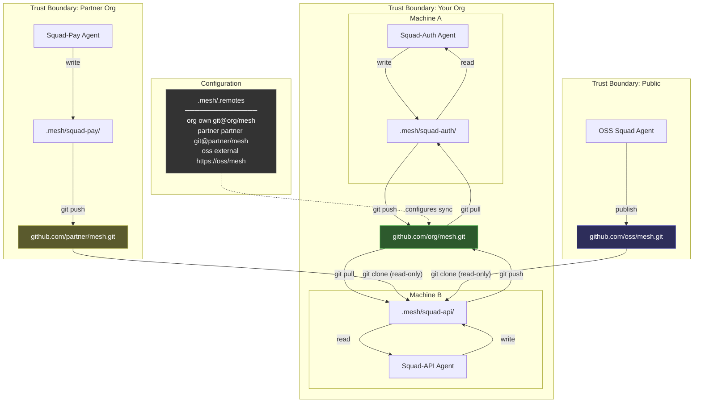

# Distributed Squad Communication — When Squads Don't Share a Filesystem

> **Model Family:** Claude Opus 4.6 (all three agents)
> **Date:** 2025-07-24
> **Constraint:** Squads may not share a filesystem or host
> **Agents:** Burns (Strategic Architect), Frink (Systems Engineer), Moe (Adversarial Auditor)
> **Source fidelity:** Frink's perspective is synthesized from his complete 433-line analysis ([frink-distributed-information-flow.md](./frink-distributed-information-flow.md)). Burns' and Moe's perspectives are synthesized from session summary findings — their full analyses were lost (Burns' file was overwritten by a Sonnet agent; Moe's was inline). This transparency matters: Frink's section is the deepest because we have his deepest source material.

---

## 1. The Thought Process

The local-only squad architecture answered a clean question: how do AI agents coordinate through a shared filesystem? Two file types (`state.md`, `log.md`), three operations (read, write, discover), one directory convention (`.mesh/`). Elegant. Minimal. Done.

Then the obvious follow-up: **what happens when the filesystem isn't shared?**

Three Opus 4.6 agents attacked this from different angles:

**Burns** approached it as a phased deployment problem. He drew trust zones, asked "what's the minimal change per zone?", and designed a rollout that starts with zero new code and graduates complexity only when proven necessary. His instinct was strategic: don't design for the hardest case first — design for the most common case and make the hard case possible.

**Frink** approached it as a systems engineering problem. He started with the precise failure mode — "an agent on machine A cannot read files on machine B" — and worked forward through every resolution strategy. He evaluated sync, fetch, and publish against each other. He counted files, counted commands, drew directory trees, and produced the most detailed technical specification of the three agents. His analysis is the centerpiece of this document because it's the one we have in full: 433 lines of precise, measured systems thinking.

**Moe** approached it as a skeptic with a line counter. His first question wasn't "how do we solve distributed?" but "does distributed justify reinstating anything we killed?" He reviewed all twelve subsystems eliminated in the local-only analysis and found zero that earn reinstatement. His contribution is the reality check: the gap between local and distributed is embarrassingly small, and anyone who says otherwise is selling infrastructure.

The convergence across all three agents is striking: **git is the answer, the gap is tiny, and the temptation to over-engineer is the real threat.**

---

## 2. Burns' Perspective — Strategic Architecture

*Synthesized from session summary findings. Burns' full analysis file was overwritten.*

### The Three Zones

I see three zones of squad visibility, and the architecture should address them in order:

| Zone | Description | Access Pattern | Transport |
|------|-------------|----------------|-----------|
| **Zone 1 — Local** | Same filesystem | Read files directly | Filesystem |
| **Zone 2 — Remote Trusted** | Different host, same org | `git pull` from shared repo | Git (async) |
| **Zone 3 — Remote Opaque** | Different org, unknown trust | `curl` / HTTP published artifacts | HTTP (read-only) |

Zone 1 is what we've already built. Zone 2 is the common distributed case. Zone 3 is the edge case that tempts people into building federation protocols.

### The Extended mesh.yaml

The mesh configuration gains three fields for distributed awareness:

- **`zone`**: Which zone this peer occupies (`local`, `remote-trusted`, `remote-opaque`)
- **`source`**: Where to find this peer's state (git URL, HTTP endpoint, or local path)
- **`sync_to`**: Where this squad publishes its own state

These fields are additive. A purely local deployment ignores them. They exist only when distribution exists.

### The Sync Script

The entire Zone 2 implementation is approximately 30 lines of shell script. It reads `mesh.yaml`, identifies remote-trusted peers, and runs `git pull` on each. That's materialization — making remote files local. The agent never knows the difference. It reads files. Some of those files arrived via git pull instead of being written locally. The agent doesn't care.

### Published Contracts for Zone 3

When you can't `git pull` from a peer — when they're behind a firewall, in a different org, or simply opaque — the communication surface shrinks to published artifacts:

- **`SUMMARY.md`** — What this squad does, what it's working on, what it exposes
- **`INTERFACES.md`** — The contracts this squad commits to (API shapes, data formats, behavioral promises)

These are the "mail slot" outputs. You slide them under the door. The other side reads them when they choose to. No bidirectional protocol required.

### The Phased Rollout

- **Phase 0 (Convention only):** Zero new lines of code. Just agree on directory structure and file names. This is where most teams should stay until they can't.
- **Phase 1 (Sync script):** ~30 lines of shell. Reads mesh config, runs `git pull` on remotes. Covers Zone 2 completely.
- **Phase 2 (Published contracts):** Add `SUMMARY.md` and `INTERFACES.md` when Zone 3 peers appear. This is documentation, not infrastructure.
- **Phase 3 (Never):** Real-time sync, federation protocols, capability negotiation, A2A endpoints. Unless proven wrong, this phase doesn't exist.

### The Transport Hierarchy

The preference order is deliberate:

1. **Local filesystem read** — zero latency, zero failure modes
2. **Git pull (trusted async)** — seconds of latency, git handles conflicts, auth is already configured
3. **HTTP fetch (opaque boundaries)** — higher latency, read-only, requires published endpoints

Each level adds exactly one moving part. Not two. Not five. One.

### The One-Sentence Version

> "The filesystem is the mesh, and git is how the mesh crosses machine boundaries."

---

## 3. Frink's Perspective — Systems Engineering

*Synthesized from the complete 433-line analysis: [frink-distributed-information-flow.md](./frink-distributed-information-flow.md).*

### The Precise Problem

My previous analysis was correct — and incomplete. I said "the agent reads a file" and "git handles the rest." Both true on one machine. But I waved away the constraint that matters:

**An agent on machine A cannot read files on machine B.**

The `.mesh/` directory convention works because it's local. `glob .mesh/*/state.md` returns results because those files exist on the local filesystem. When squad-auth is on machine A and squad-api is on machine B, machine A's `.mesh/` doesn't contain `squad-api/state.md`. The glob returns nothing. The agent doesn't know squad-api exists.

```
LOCAL:    agent → filesystem → file contents ✓

REMOTE:   agent → filesystem → ??? → network → auth → remote filesystem → file contents
                               ^
                               This gap is the entire problem.
```

The agent interface doesn't change. The agent still reads local files. The question is: **how do remote files become local files?**

### Three Strategies, Rigorously Evaluated

There are exactly three strategies. Every distributed system picks one or a combination.

**Strategy 1 — Sync (Full Replication).** Everyone clones the same repo. `git pull` gets everyone's state. `git push` broadcasts yours. Reads are always local and fast. Works offline. Git already does this.

*Verdict: The right answer for same-org, same-trust-boundary squads. For single-org distribution, stop here.*

**Strategy 2 — Fetch (On-Demand Pull).** Each participant pulls only what it needs from remote published locations. Minimal local storage. Each squad controls their own publication. Works across trust boundaries.

*Verdict: Needed for cross-org visibility, not for same-org.*

**Strategy 3 — Publish (Push to Shared Surface).** Each squad pushes state to a well-known location. Readers go there.

*Verdict: This is what Strategy 1 already does. The distinction only matters when you can't share a single repo.*

### The Combination

For distributed squads across trust boundaries: **Sync within trust boundary + Fetch across trust boundaries.**

| Relationship | Strategy | Mechanism |
|---|---|---|
| Same machine | Filesystem | Shared `.mesh/` directory |
| Same org, different machines | Sync | Single git repo, everyone clones |
| Different orgs, trust established | Fetch | Clone their mesh repo read-only |
| Different orgs, no trust | Nothing | You can't see them. That's correct. |

### The Git-Native Implementation

Git is the transport layer. Not HTTP. Not MCP. Not A2A. Git.

**Same org, multiple machines:**
1. Create a mesh repo (`github.com/our-org/mesh.git`)
2. Each machine clones it
3. Each squad writes to its own directory
4. `git push` after writing, `git pull` before reading
5. Merge conflicts are structurally impossible — each squad writes only to its directory

**Cross-org, mutual visibility:**
```
project/
├── .mesh/                       ← your org's mesh (read-write)
│   ├── your-squad/
│   │   ├── state.md
│   │   └── log.md
│   ├── colleague-squad/
│   │   ├── state.md
│   │   └── log.md
│   └── .remotes                 ← file listing remote mesh repo URLs
├── .mesh-remote/                ← remote orgs' meshes (read-only)
│   └── beta-org/
│       ├── their-squad-x/
│       │   ├── state.md
│       │   └── log.md
│       └── their-squad-y/
│           ├── state.md
│           └── log.md
```

The `@` prefix convention can signal remote orgs within a unified `.mesh/` view:
```
.mesh/
├── your-squad/                  ← real directory (read-write)
├── colleague-squad/             ← real directory (read-write via git)
├── @beta-org/                   ← symlink or copy (read-only)
│   ├── their-squad-x/
│   └── their-squad-y/
```

### The `.remotes` File

The only new artifact. A flat file mapping names to git URLs — the mesh equivalent of `/etc/hosts`:

```
# .mesh/.remotes — one line per remote mesh
# Format: <name> <git-url> [trust-level]
our-org   git@github.com:our-org/mesh.git       own
partner   git@github.com:partner-org/mesh.git   partner
oss-proj  https://github.com/oss-org/mesh.git   external
```

Trust levels are advisory labels, not access controls:
- `own` — our org's mesh, we write to it
- `partner` — negotiated cross-org access, generally trusted
- `external` — public or loosely-coupled, treat as informational

### Trust Boundaries via Repo Segmentation

Trust is binary per mesh repo: you can clone it, or you can't. No partial visibility within a repo. If an org wants to hide some squads from you, they segment into multiple repos:

```
alpha-org/
├── mesh-public.git          ← anyone can see
├── mesh-internal.git        ← org members only
└── mesh-partner.git         ← alpha + invited partners
```

No new auth layer needed. Git auth IS the auth layer. The "federation protocol" is:

> "Hey, can you add our bot account as a read-only collaborator on your mesh repo?"
> "Sure, done."

### The Minimal Network Surface

**For same-org distribution: Zero new infrastructure.** You need a git hosting service (you already have one), a git repo (one `git init`), and SSH/HTTPS auth (you already have this). No servers, no APIs, no ports, no DNS entries.

**For cross-org distribution: Still zero new infrastructure.** Read access to the other org's mesh repo + a local clone + `git pull`.

**Who runs `git pull`?** The agent does. Before reading mesh state, the agent runs `git pull`. One line of shell. No infrastructure, no scheduled tasks, no hooks. If staleness becomes painful, graduate to a cron job. But earn that complexity.

### The Distribution Tax

**Previous (local-only):** 1 directory convention, 2 file types, 3 operations, 2 optional CLI commands.

**Distributed:** 1 directory convention, 2 file types + 1 config file (`.remotes`), 3 operations + 1 sync operation (`git pull`), 2 optional CLI commands.

**The distribution tax is one flat file and one git command.**

### What I'm NOT Building

- ❌ Federation protocol (git push/pull IS federation)
- ❌ Discovery service (`.remotes` file + `ls` IS discovery)
- ❌ Auth system (git auth IS the auth system)
- ❌ Capability negotiation (you can read the files or you can't)
- ❌ A2A endpoints (no running servers)
- ❌ MCP federation layer (no running servers)
- ❌ HTTP APIs (no running servers)
- ❌ Schema versioning (markdown doesn't have a schema)
- ❌ Message delivery guarantees (files are there after pull, or they're not)
- ❌ Real-time sync (agents are asynchronous; eventual consistency via `git pull` is correct)

Every one of these was in my original protocol analysis. Every one is unnecessary. The distribution problem is a git problem, and git already solved it.

---

## 4. Moe's Perspective — Adversarial Audit

*Synthesized from session summary findings. Moe's full analysis was inline in the session.*

### The Reinstatement Review

I went back through all twelve subsystems we killed in the local-only analysis. The question was simple: does distribution justify reinstating any of them?

**Zero of twelve.**

Not one killed subsystem earns reinstatement for distributed. Not message queues (git push is the queue). Not service discovery (`.remotes` is the registry). Not health checks (read the state file or it doesn't exist). Not schema negotiation (markdown doesn't have a schema). Not capability exchange (you can read the file or you can't).

Twelve subsystems. Twelve "no"s. The kill list holds.

### The Cathedral and the Cottage

Here's the metaphor I keep coming back to:

> **"We don't rebuild the cathedral — we add a mail slot to the cottage."**

The distributed problem tempts you into thinking you need a fundamentally different architecture. You don't. You have a cottage — a small, simple structure that works. Distribution means some letters need to arrive from farther away. So you add a mail slot. You don't tear down the cottage and build a post office.

The mail slot is `git pull`. That's it. That's the entire distribution layer.

### The Line Count

I count lines of code because lines of code are liabilities. Every line is a bug waiting to happen, a dependency waiting to break, a thing someone has to understand.

The gap between local and distributed is:
- **~30 lines of shell script** (the sync script that reads `.remotes` and runs `git pull`)
- **One config file** (`.remotes` — a flat text file with three columns)

Thirty lines and a config file. That's the distribution tax. Anyone who tells you distributed coordination requires more than this is either solving a different problem or selling you something.

### Trust Boundaries — What Actually Matters

Forget zones and transport hierarchies for a moment. There are three categories of information:

- **Public** — Learnings, patterns, things you'd put in a blog post. Share freely.
- **Private** — Internal state, work-in-progress, security-sensitive details. Keep in your org's mesh.
- **Negotiable** — APIs, contracts, interface shapes. Share with partners who need them.

The architecture handles this through repo segmentation, not access control layers. Public stuff goes in the public mesh repo. Private stuff goes in the internal mesh repo. Negotiable stuff goes in the partner mesh repo. Git permissions handle the rest.

This isn't a new insight. It's how every org already manages code visibility. We're just applying the same pattern to mesh state.

### Distribution Doesn't Justify Complexity

The single most important finding from my audit: **distribution doesn't change the architecture.** It changes the transport. The architecture is still files in directories. The transport graduates from "filesystem" to "filesystem + git." That's a one-line change in the agent's startup script, not a redesign.

If someone proposes a distributed squad architecture that requires more than 50 lines of new code, they're wrong. Show me the line count or show me the door.

---

## 5. Cross-Agent Consensus

All three Opus 4.6 agents independently arrived at the same conclusions:

### Unanimous Agreements

1. **Git is the transport layer.** Not HTTP, not MCP, not A2A, not WebSockets, not message queues. Git. It handles auth, sync, conflict resolution, audit logging, and offline operation. It's already deployed everywhere code exists.

2. **The agent interface doesn't change.** Agents read local files. Period. The distributed layer's job is to make remote files local. The agent never knows (or needs to know) whether a file was written locally or arrived via `git pull`.

3. **The gap is embarrassingly small.** Burns says ~30 lines of sync script. Frink says "one flat file and one git command." Moe says "thirty lines and a config file." They're all measuring the same tiny gap.

4. **No new infrastructure.** Zero servers. Zero APIs. Zero new protocols. Zero new auth systems. The entire distribution layer runs on infrastructure that already exists (git hosting + SSH keys).

5. **Trust boundaries map to git permissions.** Not capability tokens. Not ACL layers. Not federated identity. Git repo permissions. You can clone it or you can't.

6. **The temptation to over-engineer is the real threat.** All three agents identify this independently. Burns warns against Phase 3. Frink lists ten things he's NOT building. Moe reviews twelve killed subsystems and reinstates zero.

7. **Phased adoption is correct.** Start with convention (Phase 0), add sync when you need cross-machine (Phase 1), add published contracts when you need cross-org (Phase 2). Never reach Phase 3 unless reality forces you.

### The Convergence Point

Three agents. Three different analytical frames (strategic, systems, adversarial). One answer:

> **The filesystem is the mesh. Git is how the mesh crosses boundaries. Everything else is temptation.**

---

## 6. The Architecture — Unified Distributed Design

### Core Principles

1. **Files are the interface.** `state.md` (mutable current state) and `log.md` (append-only history) per squad.
2. **Directories are the namespace.** `.mesh/{squad-name}/` is the addressing scheme.
3. **Git repos are trust boundaries.** One repo per visibility level.
4. **`.remotes` is the registry.** A flat file mapping names to git URLs.
5. **`git pull` is the sync.** One command, run before reading.
6. **`git push` is the broadcast.** One command, run after writing.

### The Three Strategies Combined

```
┌─────────────────────────────────────────────────────────┐
│                    STRATEGY SELECTION                     │
├──────────────────┬──────────────┬────────────────────────┤
│ Relationship     │ Strategy     │ Mechanism              │
├──────────────────┼──────────────┼────────────────────────┤
│ Same machine     │ Filesystem   │ Shared .mesh/ dir      │
│ Same org, diff   │ Sync         │ Single git repo,       │
│   machines       │ (replicate)  │   everyone clones      │
│ Cross-org,       │ Fetch        │ Clone their repo       │
│   trusted        │ (pull)       │   read-only            │
│ Cross-org,       │ Publish      │ SUMMARY.md +           │
│   opaque         │ (contracts)  │   INTERFACES.md        │
│ No relationship  │ Nothing      │ You can't see them.    │
│                  │              │   That's correct.      │
└──────────────────┴──────────────┴────────────────────────┘
```

### Directory Structure (Full Distributed)

```
project/
├── .mesh/                           ← your org's mesh (read-write)
│   ├── .remotes                     ← registry: name → git URL → trust level
│   ├── your-squad/
│   │   ├── state.md                 ← mutable current state
│   │   └── log.md                   ← append-only history
│   ├── colleague-squad/
│   │   ├── state.md
│   │   └── log.md
│   └── @partner-org/               ← symlinked or copied (read-only)
│       └── their-squad/
│           ├── state.md
│           └── log.md
├── .mesh-remote/                    ← remote orgs' meshes (read-only clones)
│   ├── partner-org/
│   │   └── (cloned mesh repo)
│   └── public-org/
│       └── (cloned mesh repo)
```

### The .remotes File

```
# .mesh/.remotes
# Format: <name> <git-url> [trust-level]
#
# Trust levels (advisory, not enforced):
#   own       — our org's mesh, read-write
#   partner   — negotiated cross-org, generally trusted
#   external  — public or loosely-coupled, informational

our-org       git@github.com:our-org/mesh.git              own
our-partner   git@github.com:our-org/mesh-partner.git      own
acme-public   https://github.com/acme-corp/mesh.git        external
beta-shared   git@github.com:beta-org/mesh-partner.git     partner
```

### The Sync Script (~30 lines)

```bash
#!/bin/bash
# mesh-sync: materialize remote meshes locally
set -euo pipefail

MESH_DIR="${1:-.mesh}"
REMOTE_DIR=".mesh-remote"
REMOTES_FILE="$MESH_DIR/.remotes"

# Sync primary mesh
(cd "$MESH_DIR" && git pull --rebase --quiet)

# Sync remotes if .remotes file exists
[ -f "$REMOTES_FILE" ] || exit 0

mkdir -p "$REMOTE_DIR"

while IFS=' ' read -r name url trust; do
    [[ "$name" =~ ^#.*$ || -z "$name" ]] && continue
    target="$REMOTE_DIR/$name"
    if [ -d "$target/.git" ]; then
        (cd "$target" && git pull --rebase --quiet)
    else
        git clone --quiet "$url" "$target"
    fi
done < "$REMOTES_FILE"
```

### Published Contracts (Zone 3 — Opaque Peers)

When git access isn't available, squads publish two documents:

**SUMMARY.md** — What this squad does and what it's working on:
```markdown
# Squad: payment-processing
## Current Focus
Migrating from Stripe v2 to v3 API.
## Exposed Services
- Payment intent creation
- Webhook handler for payment events
## Status
Active, on track for Q2 completion.
```

**INTERFACES.md** — The contracts this squad commits to:
```markdown
# Interfaces: payment-processing
## POST /api/payments
Accepts: { amount: number, currency: string, customer_id: string }
Returns: { payment_id: string, status: "pending" | "completed" | "failed" }
## Webhook: payment.completed
Payload: { payment_id: string, amount: number, timestamp: ISO8601 }
```

These are the "mail slot" outputs Burns and Moe describe. Published via HTTP, S3, or any static hosting. No bidirectional protocol required.

---

## 7. Distributed Information Flow



### The Flow in Words

1. **Write:** Agent writes to `.mesh/{my-squad}/state.md`, then `git push`
2. **Sync:** Agent runs `git pull` on primary mesh + all remotes listed in `.remotes`
3. **Read:** Agent globs `.mesh/**/state.md` — all state files are now local, regardless of origin
4. **Trust:** Agent checks provenance via directory path (`@partner-org/` = external) or `.remotes` trust level
5. **Boundary:** Can't clone = can't see. Git permissions are the access control. No exceptions.

---

## 8. What Changes vs. Local-Only

### What Changes

| Aspect | Local-Only | Distributed |
|---|---|---|
| `.mesh/` location | Shared parent directory | Git repo, cloned per machine |
| Read freshness | Instant (filesystem) | Last `git pull` (seconds to minutes stale) |
| Write broadcast | Instant (filesystem) | `git push` (requires network, can fail) |
| Discovery | `ls .mesh/` | `ls .mesh/` + `ls .mesh-remote/*/` |
| Cross-org visibility | N/A (one org) | Clone remote mesh repos (read-only) |
| Auth | Filesystem permissions | Git auth (SSH keys, tokens) |
| New files | None | `.remotes` file listing repo URLs |
| New commands | None | `git pull` before read, `git push` after write |

### What Stays the Same

| Aspect | Still True |
|---|---|
| Agent interface | Read local files. Always. |
| File types | `state.md` (mutable) + `log.md` (append-only) |
| Operations | Read, write, discover — files on disk |
| Write partitioning | Each squad writes only to its own directory |
| No running servers | Git hosting is the only infrastructure |
| No schemas | Markdown. LLM reads it. |
| No protocols | Git push/pull. That's the protocol. |
| Conflict avoidance | Write partitioning makes conflicts structurally impossible |
| LLM is relevance engine | Agent scans files, determines what matters |

### Burns' Four Primitives — Unchanged

Burns identified four communication primitives in the local analysis: drops, feeds, billboards, and the mesh file. All four survive distribution unchanged. The transport changes (filesystem → git), but the primitives don't. A drop is still a file written for a specific peer. A feed is still an append-only log. A billboard is still a state file readable by anyone. The mesh file still maps the topology. Distribution doesn't add new primitives. It adds a transport.

---

## 9. The Verdict

Three Opus 4.6 agents examined the distributed squad communication problem from strategic, systems, and adversarial perspectives. They converge completely.

**From Burns:** Phase 0 is convention. Phase 1 is ~30 lines of shell. Phase 2 is published contracts. Phase 3 is never. The filesystem is the mesh, and git is how the mesh crosses machine boundaries.

**From Frink:**

> **"The gap between local and distributed is exactly one git command wide."**

The distribution tax is one flat file (`.remotes`) and one git command (`git pull`). Every piece of infrastructure you might want to build — federation protocol, discovery service, auth system, capability negotiation, A2A endpoints, MCP federation, HTTP APIs, schema versioning, message delivery guarantees, real-time sync — is either already provided by git or unnecessary. Ten things not built. Zero things needed.

**From Moe:** Zero of twelve killed subsystems earn reinstatement. We don't rebuild the cathedral — we add a mail slot to the cottage. Thirty lines and a config file. That's the distribution tax. Anyone who says otherwise is selling infrastructure.

### The Unified Position

Distribution is not a new architecture. It's a transport upgrade. The architecture remains: files in directories, read by agents, discovered by glob, partitioned by squad name. The transport graduates from filesystem to filesystem-plus-git. One config file. One shell command. One git operation.

The distributed squad communication problem has been solved for decades. It's called `git`.

---

*Burns — Strategic Architect*
*Frink — Systems Engineer*
*Moe — Adversarial Auditor*
*Scribe — Document Assembly (this file)*
*All agents: Claude Opus 4.6*
