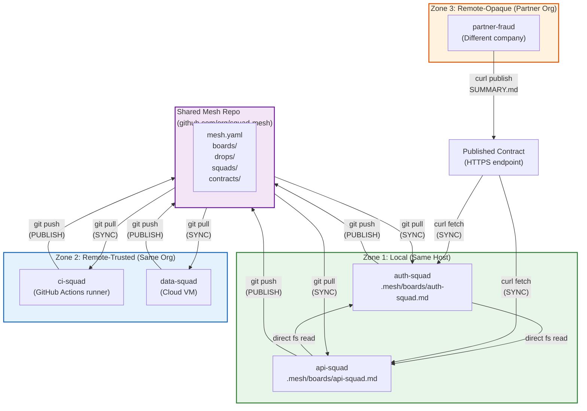

# AI Thought × Solution: Distributed Squad Communication

> **Date:** 2026-03-16
> **Model Family:** Claude Sonnet 4.5 (all three agents)
> **Constraint:** Squads may not share the same filesystem or host
> **Agents:** Burns (Lead Architect), Frink (Systems Engineer), Moe (Skeptic/Critic)
> **Assembled by:** Scribe (Documentation Specialist)

---

## The Thought Process

Three agents. The same model family. The same constraint: *what happens when `cat ../squad-b/SUMMARY.md` returns "No such file or directory"?* Each approached the problem from a different starting point — and all three converged on the same answer.

### Burns — Thinking in Zones

Burns started with a map. His opening question: **"What are the different *kinds* of remote?"** Not all remote squads are the same. A CI runner in your org is different from a partner company's API team. Burns' instinct was to categorize before solving — three zones of trust and proximity (local, remote-trusted, remote-opaque), each with its own transport mechanism and trust boundary. He thinks in phases: what to ship now, what to defer, what to never build.

### Frink — Thinking in Strategies

Frink started with a taxonomy of mechanisms. His opening question: **"What makes remote files appear as local files before the agent wakes up?"** He identified exactly three strategies — sync, fetch, publish — evaluated each against concrete tradeoffs, then proved that the hybrid (publish + fetch) is structurally identical to git. From there, Frink engineered the full data structure: a mesh repo with write-partitioned directories, a lifecycle with two git operations, trust tiers mapped to git's permission model. Every claim backed by a file layout or a shell command.

### Moe — Auditing the Deleted Code for Resurrection

Moe started with suspicion. His opening question: **"How many of the 3,756 lines we deleted will someone try to bring back?"** The answer: zero. Moe's method was to enumerate every over-engineering trap that distribution *sounds* like it requires — service discovery, message brokers, schema validation, real-time sync, authentication frameworks — and prove each one is unnecessary. He measured the honest solution at 30 lines of code + 10 lines of config, then calculated the ratio against what was deleted: **125:1**.

> *"The distance between 'read a local file' and 'fetch a remote file' is one line of curl. The distance between 'fetch a remote file' and 'build a federation protocol' is 10,000 lines of regret."* — Moe

---

## Burns' Perspective — Zones, Phases, and Materialization

### The Core Insight

> "The filesystem is still the mesh. But some parts of the mesh need to be *materialized locally* before agents can read them."

Burns frames the entire distributed problem as a **materialization problem**, not a protocol problem. The agent interface doesn't change. Files still exist. They just need to *arrive* before they can be read.

### Three Zones of Communication

**Zone 1 — Local (Same Host / Same Filesystem)**
Direct filesystem reads. Zero transport. The original solution, unchanged. `cat ../squad-b/.mesh/` just works.

**Zone 2 — Remote-Trusted (Different Host, Same Org / Shared Auth)**
Files exist but aren't on your disk. You have credentials. Git is the transport: `git pull` turns a Zone 2 relationship into a Zone 1 relationship. The files appear on disk; the agent reads them.

**Zone 3 — Remote-Opaque (Different Org / No Shared Auth / Published Interfaces Only)**
You can't see their `.mesh/` directory. You can't clone their repo. They publish a contract — SUMMARY.md, INTERFACES.md — and you consume it via `curl` or equivalent. Their internals are invisible by design.

### mesh.yaml Extensions

Three fields added to the original `mesh.yaml`:

```yaml
squads:
  - name: auth-squad
    path: ../auth-squad/.mesh
    zone: local

  - name: ci-squad
    zone: remote-trusted
    source: git@github.com:our-org/ci-squad.git
    ref: main
    sync_to: .mesh/remotes/ci-squad

  - name: partner-auth
    zone: remote-opaque
    source: https://partner.dev/squad-contracts/auth/SUMMARY.md
    sync_to: .mesh/remotes/partner-auth
```

### The Agent Lifecycle (Updated with SYNC/PUBLISH)

```
Agent wakes up
  │
  ├─ SYNC phase (new): Materialize remote state into local filesystem
  │    ├─ Zone 1 peers: nothing to do (already on disk)
  │    ├─ Zone 2 peers: git pull (or equivalent)
  │    └─ Zone 3 peers: fetch published artifacts
  │
  ├─ READ phase (unchanged): Read .mesh/ — all files now local
  │
  ├─ WORK phase (unchanged): Do the task
  │
  ├─ WRITE phase (unchanged): Update own billboard, log, drops
  │
  └─ PUBLISH phase (new): Push local state for remote peers
       ├─ Zone 1 peers: nothing to do (they can already read it)
       ├─ Zone 2 peers: git push
       └─ Zone 3 peers: publish artifacts to agreed location
```

### Concrete Examples

**Developer Laptop + CI Squad (Zone 2):** Auth-squad agent wakes up, `git pull` brings ci-squad's latest results, agent reads the board ("3 test failures in auth module"), adjusts work accordingly, pushes results when done. Total overhead: one `git pull`, one `git push`.

**Two Orgs Collaborating (Zone 3):** Payment-squad fetches partner fraud-detection-squad's published SUMMARY.md via curl. It reads: "Risk scoring v3 API deprecated April 15. New field `device_fingerprint` required." Agent adds the field. Partner can't see payment-squad's internals — Zone 3 is one-way unless you also publish.

**Ephemeral CI Squad (Zone 2):** CI runner spins up, runs tests, writes results to mesh repo, `git push`, dies. Next day, auth-squad `git pull`s, reads the results, fixes the failures. The transport gives ephemeral squads permanence.

### Burns' Phased Rollout

| Phase | Trigger | What Ships |
|-------|---------|------------|
| 0 | Default | Convention only. Document zones, `mesh.yaml` fields, git pull/push. README paragraph. |
| 1 | Manual sync gets tedious | Sync script (~30 lines bash). |
| 2 | A Zone 3 partner appears | Published contracts + curl fetch (~10 more lines). |
| 3 | Never (unless proven wrong) | No MCP federation, A2A, service discovery, message queues. |

---

## Frink's Perspective — Strategies, Git-Native Design, and Write Partitioning

### The Core Insight

> "The entire distribution problem reduces to: 'put the coordination files in a shared repo.' That's not an architecture. It's a README paragraph. Which is exactly the right size for a problem this simple."

Frink's approach was rigorous elimination. Three strategies exist for making remote files local. He evaluated all three, then proved the natural hybrid is git.

### Sync vs Fetch vs Publish

| Strategy | Mechanism | Tradeoff |
|----------|-----------|----------|
| **Sync** | Background daemon mirrors files continuously | Agent unchanged, but requires always-on infra |
| **Fetch** | Pull on demand at agent wake-up | No daemon, but latency at startup; needs URLs and auth |
| **Publish** | Push state to a shared location | Decoupled, cross-org capable, but eventual consistency |

**The hybrid that falls out:** Publish + Fetch. Each squad publishes its state somewhere reachable, each squad fetches others' state before starting work. And we already have a tool that does Publish + Fetch with built-in auth, branching, merge semantics, and transport: **git**.

### The Mesh Repo as Its Own Git Repo

Frink's structural answer: separate `.mesh/` into a dedicated git repository.

```
mesh-repo/                          <-- Hosted on GitHub / GitLab / any git server
├── mesh.yaml                       <-- Squad directory
├── boards/
│   ├── auth-squad.md               <-- Written only by auth-squad
│   ├── api-squad.md                <-- Written only by api-squad
│   └── data-squad.md               <-- Written only by data-squad
├── drops/
│   ├── 2026-03-14-auth-jwt-rotation.md
│   └── 2026-03-14-api-rate-limits.md
├── contracts/
│   └── auth-api-squad-token-format.md
└── squads/
    ├── auth-squad/
    │   ├── state.md                <-- Mutable snapshot
    │   └── log.md                  <-- Append-only
    ├── api-squad/
    │   └── ...
    └── data-squad/
        └── ...
```

### Why Write Partitioning Eliminates Conflicts

Each squad writes only to `boards/{self}.md`, `squads/{self}/*`, and `drops/{date}-{self}-*.md`. No two squads write to the same file. Git push/pull never conflicts. This isn't a convention — it's a structural property: **the path contains the squad name.**

If push fails ("your branch is behind"), the fix is always:
```bash
git pull --rebase && git push
```
One-line retry. No merge resolution. Write partitioning makes this structurally safe.

### Trust Tiers Mapped to Git

| Tier | Where It Lives | Who Reads | Who Writes |
|------|---------------|-----------|------------|
| Public | Mesh repo | All squads | Each squad writes own files |
| Private | Squad's code repo (`.squad/`) | Only that squad | Only that squad |
| Negotiated | Mesh repo `/contracts/` | Parties to the contract | Parties to the contract |

> "Git's permission model IS the trust model. Repo access = read trust. Write access (plus CODEOWNERS) = write trust. Branch protection = change control. Pull requests = negotiated changes."

### The Distribution Stack

```
Layer 4: Agent reads/writes files          <-- UNCHANGED from local-only
Layer 3: .mesh/ directory conventions      <-- UNCHANGED from local-only
Layer 2: Git (pull on wake, push on exit)  <-- THE ONLY NEW THING
Layer 1: Git hosting (GitHub/GitLab)       <-- ALREADY EXISTS
```

**New concepts introduced: 1** (mesh directory is a separate repo).
**New infrastructure required: 0** (git hosting already exists).
**New protocols designed: 0.**
**Lines of agent code changed: 2** (add `git pull` to startup, `git push` to shutdown).

### Frink's Self-Correction

> *"In my protocol reality check, I designed a 4-layer protocol stack: git knowledge sharing, REST coordination hub, task cards, cross-org A2A. I now observe that layers 2-4 were solving distribution problems that git already solves. A REST hub is a centralized state store with an HTTP interface. A git repo with a hosting platform is a distributed state store with an HTTPS interface — plus auth, history, offline support, and merge semantics for free. I was reinventing git with more steps."*

---

## Moe's Perspective — The 125:1 Ratio and the Line We Must Not Cross

### The Core Insight

> "Distribution means the file isn't local, so you fetch it first — that's a curl, not a protocol."

Moe's method is subtraction. He doesn't ask "what should we build?" He asks "what must we not rebuild?" Of the 3,756 lines of TypeScript deleted in the previous round, Moe audited every subsystem for resurrection potential.

### 0 of 12 Deleted Subsystems Resurrected

The wall is real — `cat` requires a file path, file paths require a filesystem, filesystems are local. But the wall is *not* "the convention is wrong." It's "the file isn't here yet." The convention — each squad writes SUMMARY.md, others read it — is still correct. The only problem is **transport.**

> "That's a much smaller problem than 'how do we build a federation protocol.'"

### What People Think Distribution Requires vs What It Actually Requires

**What people think:**
Service discovery, API gateway, auth framework, schema versioning, health checks, circuit breakers, message queuing, conflict resolution, SDK/client libraries, monitoring stack. 10,000 lines minimum.

**What it actually requires:**
One question: *How does Squad B's SUMMARY.md get onto Squad A's filesystem?*

| Method | Lines of Code | Works For |
|--------|:---:|---|
| `git clone` a shared repo | 0 | Same org, different machines |
| Cron job: `curl` the raw file | 3 | Different orgs, same git host |
| CI step: pull summaries | 10–15 | CI servers, automated pipelines |
| Script: aggregate from remotes | 20–30 | Mixed environments |

### The Honest Architecture

| Component | Size | New Code |
|-----------|------|----------|
| SUMMARY.md convention | README section | 0 lines |
| sources.yaml | Config file | ~10 lines yaml |
| sync-summaries.sh | Bash script | ~25 lines |
| Prompt injection | Template snippet | ~5 lines |
| **Total** | | **~30 lines of code + 10 lines of config** |

Compare to what was deleted: 3,756 lines of TypeScript + 971 lines of tests.

**The ratio is 125:1.** For every line in the honest architecture, the over-engineered version had 125 lines solving the same problem.

### The Over-Engineering Traps (Each One Rejected)

| Proposal | Moe's Verdict |
|----------|---------------|
| Real-time aggregation service | ❌ Agents wake/work/sleep. No real-time needed. |
| Webhook notifications | ❌ Pull, don't push. The LLM notices changes. |
| Schema validation for SUMMARY.md | ❌ Section headers yes. JSON schema with versioning no. |
| Auth/authz framework | ❌ Transport concern. HTTPS/Git already handle it. |
| Discovery protocol | ❌ `sources.txt` — a flat file. That's the protocol. |
| Consistency protocol | ❌ Summaries are inherently stale snapshots. 10 minutes is fine. |

### Moe's Line

> **"The moment you propose something that requires a running process, you've crossed the line."**

Files, git, curl, cron, CI jobs — all stateless, failure-tolerant, debuggable with `cat`. A running service requires deployment, monitoring, availability guarantees, failure handling, and operational burden. Every "simple microservice" is 2,000 lines of boilerplate, a Dockerfile, a deployment config, health checks, and an oncall rotation.

---

## Cross-Agent Consensus

All three agents — architect, engineer, and skeptic — arrived at the same conclusions independently. Here is where they agree, in their own words:

### 1. The Problem Is Transport, Not Architecture

- **Burns:** "The filesystem is still the mesh. But some parts of the mesh need to be *materialized locally* before agents can read them."
- **Frink:** "The question isn't whether agents read files. They do. The question is: what makes remote files appear as local files before the agent wakes up?"
- **Moe:** "The wall isn't 'the convention is wrong.' The wall is 'the file isn't here yet.'"

### 2. Git Is the Answer

- **Burns:** "Git is the right transport for remote-trusted squads."
- **Frink:** "We already have a tool that does Publish + Fetch with built-in auth, branching, merge semantics, and transport: git."
- **Moe:** "This is literally what git was built for — distributed collaboration on shared files."

### 3. No New Running Services

- **Burns:** Phase 3 is "Never (unless proven wrong)."
- **Frink:** "No API servers. No message brokers. No sync daemons. No databases."
- **Moe:** "The moment you propose something that requires a running process, you've crossed the line."

### 4. Write Partitioning Still Holds

- **Burns:** "Write partitioning still solves concurrency. Each squad writes to its own space."
- **Frink:** "Write partitioning eliminates merge conflicts... This isn't a convention — it's a structural property."
- **Moe:** Zero mentions of needing conflict resolution. It never even came up.

### 5. The Agent Interface Is Unchanged

- **Burns:** "Agents still read files. That's the interface."
- **Frink:** "The agent's read/write interface is identical. An agent running in the distributed model reads and writes the exact same files."
- **Moe:** "The convention (SUMMARY.md with known sections) doesn't change."

---

## The Architecture

The unified distributed design that falls out of all three analyses.

### mesh.yaml — The Unified Configuration

```yaml
# mesh.yaml — Distributed squad mesh configuration
# Combines Burns' zones, Frink's git-native structure, Moe's minimalism

mesh:
  name: our-org-mesh
  repo: git@github.com:our-org/squad-mesh.git  # Frink: mesh as its own repo

squads:
  # Zone 1: Local — direct filesystem reads
  - name: auth-squad
    zone: local
    path: ../auth-squad/.mesh

  # Zone 1: Local — another co-located squad
  - name: api-squad
    zone: local
    path: ../api-squad/.mesh

  # Zone 2: Remote-trusted — same org, git transport
  - name: ci-squad
    zone: remote-trusted
    source: git@github.com:our-org/ci-squad.git
    ref: main
    sync_to: .mesh/remotes/ci-squad

  # Zone 2: Remote-trusted — cloud-hosted squad
  - name: data-squad
    zone: remote-trusted
    source: git@github.com:our-org/data-pipeline.git
    ref: main
    sync_to: .mesh/remotes/data-squad

  # Zone 3: Remote-opaque — partner org, published contract only
  - name: partner-fraud
    zone: remote-opaque
    source: https://partner.example.com/squad-contracts/fraud/SUMMARY.md
    sync_to: .mesh/remotes/partner-fraud
    auth: bearer  # uses $PARTNER_FRAUD_TOKEN env var
```

### Sync Script Structure

```bash
#!/bin/bash
# sync-mesh.sh — The entire "distributed federation layer"
# Reads mesh.yaml, materializes remote squad state locally.
# Run before agent reads. No daemon. No service.

set -euo pipefail
MESH_YAML="${1:-mesh.yaml}"

# Zone 2: Remote-trusted — git clone/pull
for squad in $(yq '.squads[] | select(.zone == "remote-trusted") | .name' "$MESH_YAML"); do
  source=$(yq ".squads[] | select(.name == \"$squad\") | .source" "$MESH_YAML")
  ref=$(yq ".squads[] | select(.name == \"$squad\") | .ref // \"main\"" "$MESH_YAML")
  target=$(yq ".squads[] | select(.name == \"$squad\") | .sync_to" "$MESH_YAML")

  if [ -d "$target/.git" ]; then
    git -C "$target" pull --rebase --quiet 2>/dev/null || echo "⚠ $squad: pull failed (using stale)"
  else
    git clone --quiet --depth 1 --branch "$ref" "$source" "$target" 2>/dev/null \
      || echo "⚠ $squad: clone failed (unavailable)"
  fi
done

# Zone 3: Remote-opaque — fetch published contracts
for squad in $(yq '.squads[] | select(.zone == "remote-opaque") | .name' "$MESH_YAML"); do
  source=$(yq ".squads[] | select(.name == \"$squad\") | .source" "$MESH_YAML")
  target=$(yq ".squads[] | select(.name == \"$squad\") | .sync_to" "$MESH_YAML")
  auth=$(yq ".squads[] | select(.name == \"$squad\") | .auth // \"\"" "$MESH_YAML")

  mkdir -p "$target"
  auth_header=""
  if [ "$auth" = "bearer" ]; then
    token_var=$(echo "${squad^^}" | tr '-' '_')_TOKEN
    auth_header="--header \"Authorization: Bearer ${!token_var}\""
  fi

  eval curl --silent --fail $auth_header "$source" -o "$target/SUMMARY.md" 2>/dev/null \
    || echo "# ${squad} — unavailable ($(date))" > "$target/SUMMARY.md"
done

echo "✓ Mesh sync complete"
```

### Agent Lifecycle — Full Distributed Flow

```
┌─────────────────────────────────────────────────┐
│                 AGENT LIFECYCLE                  │
├─────────────────────────────────────────────────┤
│                                                 │
│  1. SYNC (new)                                  │
│     $ ./sync-mesh.sh mesh.yaml                  │
│     - Zone 1: skip (files already local)        │
│     - Zone 2: git pull --rebase --quiet         │
│     - Zone 3: curl published contracts          │
│                                                 │
│  2. READ (unchanged)                            │
│     - Read mesh.yaml → know who exists          │
│     - Read boards/*.md → current work/blockers  │
│     - Scan drops/ → cross-squad comms           │
│     - Read squads/*/log.md → memory             │
│     (Agent sees local paths. Doesn't know       │
│      which files were remote 30 seconds ago.)   │
│                                                 │
│  3. WORK (unchanged)                            │
│     - Do the actual task                        │
│     - Full context from all visible squads      │
│                                                 │
│  4. WRITE (unchanged)                           │
│     - Update boards/{self}.md                   │
│     - Append to squads/{self}/log.md            │
│     - Optionally write drops/{date}-{self}.md   │
│                                                 │
│  5. PUBLISH (new)                               │
│     $ git add -A && git commit -m "..." && push │
│     - Zone 1: skip (peers can already read)     │
│     - Zone 2: git push to shared repo           │
│     - Zone 3: copy to published/ + deploy       │
│                                                 │
└─────────────────────────────────────────────────┘
```

---

## Distributed Information Flow



---

## What Changes vs Local-Only

| Aspect | Local-Only | Distributed | Change |
|--------|-----------|-------------|--------|
| Agent reads files at startup | Yes | Yes | **None** |
| Agent writes to own subdirectory | Yes | Yes | **None** |
| Billboard per squad | `boards/{squad}.md` | `boards/{squad}.md` | **None** |
| Drops for cross-squad comms | `drops/*.md` | `drops/*.md` | **None** |
| Squad state + log paths | `squads/{squad}/state.md` | Same paths | **None** |
| Write partitioning | Convention | Convention | **None** |
| File formats | Markdown + YAML | Markdown + YAML | **None** |
| LLM as relevance engine | Yes | Yes | **None** |
| mesh.yaml | Lists local paths | Adds `zone`, `source`, `sync_to` | **Minor — 3 fields** |
| .mesh/ location | Inside squad's repo | Own git repo (or same, for local) | **Structural** |
| Agent startup | Read files | Sync, then read files | **+1 step** |
| Agent shutdown | Write files | Write files, then publish | **+1 step** |
| Transport | Filesystem | Git pull/push + curl | **New layer** |
| Infrastructure required | None | Git hosting (already exists) | **None new** |
| New running services | 0 | 0 | **None** |

---

## The Verdict

Three agents looked at the same constraint from three different angles. The architect drew zones. The engineer drew data structures. The skeptic drew a line in the sand. They all arrived at the same place.

**The distributed extension to squad communication is not an architecture change. It's a transport change.** The conventions don't change. The file formats don't change. The agent interface doesn't change. The write partitioning doesn't change. The only thing that changes is: before you read the file, you make sure it's here.

Burns calls it materialization. Frink calls it the publish-fetch hybrid. Moe calls it curl.

They're all saying the same thing:

> **"The filesystem is the mesh, and git is how the mesh crosses machine boundaries."** — Burns

> **"The distributed extension is: the `.mesh/` directory becomes its own git repo, and agent startup/shutdown includes `git pull` / `git push`."** — Frink

> **"Distribution means the file isn't local, so you fetch it first — that's a curl, not a protocol."** — Moe

### The One-Sentence Test

If someone proposes a new component for distributed squad communication, apply Moe's test:

> *Can you explain what it does in one sentence? Does it require a running process? Could curl + cron do the same thing?*

If the answer to the last two is yes, you've crossed the line.

### The Final Ratio

The entire distributed squad communication system — crossing machines, orgs, and companies — is **~30 lines of code and ~10 lines of config.** The over-engineered version that was deleted had 3,756 lines of TypeScript and 971 lines of tests.

**125:1.**

> *"The distance between 'read a local file' and 'fetch a remote file' is one line of curl. The distance between 'fetch a remote file' and 'build a federation protocol' is 10,000 lines of regret."* — Moe

---

*Assembled by Scribe from analyses by Burns (Lead Architect), Frink (Systems Engineer), and Moe (Skeptic/Critic). All agents running Claude Sonnet 4.5. No content invented — all insights, quotes, and data points synthesized from the three source documents.*
