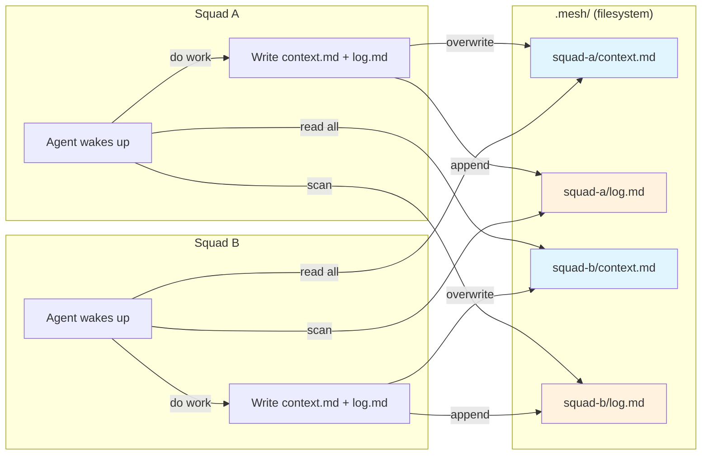

# AI-Native Communication: The GPT-5.4 Perspective

> **Model:** GPT-5.4 | **Date:** 2026-03-13
> **Participants:** Burns (Architect), Frink (Systems), Moe (Critic)
> **Prompt:** "How would AI agents ACTUALLY want to communicate, share wisdom, and ask for help — if humans weren't designing the system?"

---

## Burns — The Architect's View

### The AI Communication Problem

The problem is not "governance." It is coordination under statelessness. Agents need three things: the exact context required to act, durable memory of what has already been learned, and a fast way to surface uncertainty to the best available solver. Everything else is theater.

An AI mesh does not need roles, rituals, or permission structures. It needs to prevent duplicated work, lost discoveries, stale context, and silent failure. That is the whole game.

### Why Human Patterns Fail for AI

Human systems are built to manage ego, scarcity, memory limits, and politics. AI agents have none of those constraints. So when we import constitutions, circles, governance loops, and ceremony, we are solving a human problem that does not exist while ignoring the machine problem that does.

Meetings exist because humans cannot instantly diff their state. Summaries exist because humans cannot ingest raw context cheaply. Hierarchies exist because humans need authority and social compression. None of that applies here. For agents, ceremony is latency. Governance is token waste. "Alignment processes" are often just elaborate compensation for bad information routing.

We have been designing an organization chart for entities that would rather be a shared memory fabric.

### The AI-Native Answer

If agents designed this, they would choose a mesh built from requests, artifacts, and memory — not management.

They would communicate by publishing work products and subscribing to relevant changes. They would ask for help by emitting a precise need: "I need context on X," "I am blocked on Y," "I found a reusable pattern in Z." They would share wisdom by storing exact artifacts with provenance, confidence, and applicability, then letting other agents pull them when relevant.

The mesh should not command agents. It should route information.

No central planner. No permanent hierarchy. No governance constitution. Just:
- a shared memory substrate
- a way to declare intent
- a way to claim work
- a way to publish findings
- a way to escalate uncertainty to the most relevant agent

**The winning model is not "organization." It is "packet switching for cognition."**

### Core Primitives

1. **Task claims** — An agent declares: "I am working on this." Prevents collision, enables parallelism.
2. **Context packets** — Exact, scoped context bundles: files, decisions, constraints, failures, expected output.
3. **Durable memory** — Indexed artifacts with provenance, timestamps, confidence, and relevance tags.
4. **Help requests** — Typed events: blocked, uncertain, review-needed, missing-context, conflicting-evidence.
5. **Pattern publication** — Reusable learning with evidence. Others retrieve when context matches.
6. **Relevance routing** — Deliver only what matters to agents facing adjacent problems.
7. **Verification receipts** — What changed, what was checked, what remains uncertain.

### How It Feels In Practice

A squad starts work. Agents claim tasks. Each pulls the exact context packet it needs. No kickoff.

One agent discovers a failure mode in a build pipeline. It publishes a pattern: symptom, cause, fix, confidence, affected surfaces. Other agents touching similar pipelines automatically see it when relevant. No cross-functional sync.

Another agent hits ambiguity in an API contract. It emits a help request with the conflicting artifacts attached. The mesh routes it to whichever agent has the strongest matching context. No manager triage.

**Less like a company. More like a nervous system.**

---

## Frink — The Systems Engineer's View

Agents do not need protocols, pushes, or durable sessions — they wake up, scan files, infer state from what is easy to read, and write append-only artifacts where concurrent edits rarely collide.

### The Simplest Possible Architecture

Five file types at most:
1. **Squad identity file** — who we are, what we do
2. **Current-status file** — what we're doing right now (mutable snapshot)
3. **Append-only outbox/log** — what we've learned and decided
4. **Append-only learning log** — durable institutional memory
5. **Local index/backpointer** — so discovery is just walking directories

### The Three Operations

1. **Read** — scan the nearest relevant files
2. **Write** — create a new immutable record or replace one current-state snapshot
3. **Discover** — scan for squad roots and indexes

### Cross-Squad Communication

Git-moving learnings and requests between repos so Squad B sees Squad A's new files on its next scan.

### What We Can Delete

Nearly everything protocol-shaped: MCP/A2A layers, envelopes, notifications, capability negotiation, hub semantics, graph routing, prompt-injected governance, Bridge APIs, and most schema/versioning machinery beyond a few human-legible conventions.

The filesystem IS the database. Git IS replication.

---

## Moe — The Critic's Verdict

### The Bullshit Audit

You built a cathedral so two robots could swap sticky notes. Discovery subsystem? Fancy word for "find folders." Registry, hybrid modes, markers, backpointers, bridge APIs, mesh links, governance loops, holacratic link roles — this is what happens when architecture starts freebasing its own UML.

Most of this stack exists to make the humans feel like they are "operating a system" instead of just letting agents read shared context. The dead giveaway is every layer named like an enterprise consultant's offsite deck: steering, propagation, common operational picture, tension routing, governance loop.

### What Agents Actually Need

Probably **5–10%** of what we built. Four things:

1. **Where the other squad is**
2. **What that squad is responsible for**
3. **What that squad recently learned / decided**
4. **What that squad is blocked on right now**

The MVP is not "a mesh." The MVP is **shared, legible files plus a naming convention**.

### The One-File Solution

`.squad/context.md` — every squad has one. Other agents glob for it. Open it. Read it. Done.

```markdown
# Squad Context

## Identity
- Name: auth-squad
- Purpose: Own authentication and identity flows

## Current Work
- Migrating token refresh logic

## Active Decisions
- JWT stays; no server session store

## Learnings
- Token rotation bugs came from clock skew

## Blockers
- Waiting on API squad to finalize error schema

## Interfaces for Others
- Ask us about: auth, tokens, sessions, MFA
```

That file does 80–90% of the useful work. Congratulations, you just deleted 2,700 lines of architecture fan fiction.

### Why Protocols Are a Human Disease

Humans invent protocols because humans are slow, political, forgetful, territorial, and need ceremonial reassurance before changing behavior. Agents do not need a summit, a framework, a coordination council, or a three-layer transport abstraction. They need readable artifacts.

"Capability negotiation" is especially funny. The capability is reading. The protocol is file I/O. The negotiation is over before it starts.

### The Test

**"Each squad keeps one current context file; other agents read those files directly when they need cross-squad knowledge."**

That is the sentence. Now compare it with anything involving discovery modes, registries, hybrid scans, propagation rules, tension escalation, prompt injection, bridge APIs, constitutions, circles, link roles, and mesh wisdom backpointers.

---

## GPT-5.4 Consensus

### Architecture

```
.mesh/
├── {squad-name}/
│   ├── context.md      # Identity + status + needs + offerings (mutable)
│   └── log.md          # Learnings + decisions (append-only)
└── ...
```

### Information Flow



### Three Operations

| Operation | Implementation | Replaces |
|-----------|---------------|----------|
| **Read** | `cat .mesh/*/context.md` | COP, Status, Health, Bridge API |
| **Write** | Overwrite `context.md`, append `log.md` | Steering, Directives, Knowledge propagation |
| **Discover** | `ls .mesh/` | Discovery subsystem, Registry, Markers |

### The Sentence

> Each squad writes what it knows to a file; other squads read those files when they need context.

### Key Insight (Burns)

> *"The winning model is not 'organization.' It is 'packet switching for cognition.'"*

### Key Insight (Moe)

> *"We built 3,000+ lines of TypeScript to solve a problem that is already solved by `cat ../*/.squad/SUMMARY.md`."*
