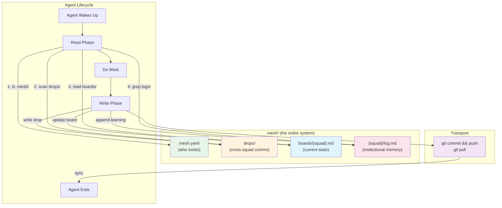

# AI-Native Communication: The Claude Opus 4.6 Perspective

> **Model:** Claude Opus 4.6 | **Date:** 2026-03-13
> **Participants:** Burns (Architect), Frink (Systems), Moe (Critic)
> **Prompt:** "How would AI agents ACTUALLY want to communicate, share wisdom, and ask for help — if humans weren't designing the system?"

---

## Burns — The Architect's View

### The AI Communication Problem

Strip away every framework, every organizational theory, every pattern we borrowed from human management. What's left?

An AI agent wakes up. It has a task. It has no memory of yesterday. It needs three things:

1. **What do I need to know right now?** — Context relevant to my current task
2. **What have others learned that would help me?** — Wisdom from agents who've been here before
3. **I'm stuck — who has the answer?** — A way to surface a need and get a response

That's the entire communication problem. Everything else — governance, tension protocols, directive authority, escalation timers, COP rollups, steering policies — exists because *humans* need those things. Agents don't.

### Why Human Patterns Fail for AI

We've been designing squad-mesh like it coordinates humans who happen to use AI tools. Look at what we've built:

- **Steering with directive authority levels** (`leader-only`, `any-squad`, `designated`) — A permissions model for political trust. Agents don't have politics.
- **Tension routing with escalation timers** (`autoEscalateAfter: 'P3D'`) — Escalation exists because humans forget or avoid conflict. An agent processes every input it receives.
- **Common Operational Picture with staleness thresholds** — A compression layer for humans who can't absorb raw data. Agents read every status file in milliseconds.
- **Knowledge propagation with relevance classification** — A taxonomy so human coordinators can decide what to share. Agents don't need pre-filtering. Give them access to everything. They'll filter by relevance *faster and more accurately than any classification heuristic we write*.
- **Backpointers, registry, mesh topology** — A linking system because we assumed squads need persistent relationships. They don't. They need to find relevant files *right now*.

Every subsystem solves a *human* coordination failure that AI agents don't have. The holacracy-to-mesh rebrand removed the label but kept the architecture.

### The AI-Native Answer

**A shared filesystem with conventions.** That's the whole answer.

The filesystem IS the mesh. Agents already read and write files. Every "communication protocol" we designed is ultimately a file operation with ceremony around it. Strip the ceremony:

- A **directive** is a file that says what to do
- A **learning** is a file that captures something discovered
- A **status** is the agent's working state — decisions, history, task lists, git log
- A **request for help** is a file that describes what's needed

**Pull, don't push.** Human coordination is push-based ("I'll notify you when something changes") because humans have limited attention. Agents can scan a directory tree in milliseconds. The AI-native pattern is pull-based: read everything relevant before starting work, write what you learned when done.

**Context over structure.** We've been structuring knowledge to make it navigable by humans. Agents don't navigate — they search. They can grep. They can read entire directories. They don't need a taxonomy. An agent would rather read 50 raw learnings and decide what's relevant than receive 5 pre-filtered ones that might miss something.

### Core Primitives — Four Total

#### 1. The Drop

A file written to a known location that other agents can find.

```
.mesh/drops/
  2026-03-16-auth-squad-jwt-rotation-pattern.md
  2026-03-16-api-squad-needs-rate-limit-guidance.md
```

Minimal frontmatter: `from`, `tags`, `kind` (learning | question | heads-up). Three fields. That's it.

#### 2. The Feed

A convention: before starting work, scan `.mesh/drops/` for anything relevant. No subscription. No filtering service. No propagation engine. For large meshes, add a single `index.md` as a table of contents.

#### 3. The Billboard

A single file per squad: `.mesh/boards/{squad}.md` — current work, blockers, offerings. Not a structured status object. Plain-text billboard updated when things change.

#### 4. The Mesh File

One YAML file listing squad names and paths. That's the entire "discovery" subsystem.

### What We Delete

| Current Subsystem | Verdict | Why |
|---|---|---|
| Discovery (marker scanning, hybrid mode, registry) | **Replace** with `mesh.yaml` | A simple list is enough |
| Steering (directives, authority, escalation) | **Delete** | Drops with `kind: heads-up` cover it |
| Tension routing | **Delete** | Drops with `kind: question` replace it |
| COP / Status rollup | **Replace** with billboards | Agents read files |
| Knowledge classification | **Delete** | Agents filter better than our heuristics |
| Coordinator prompt injection | **Keep but simplify** | 5 lines, not a subsystem |
| Bridge API | **Delete** | Wraps file reads |
| Health monitoring | **Delete** | Read the billboard timestamp |
| Backpointers | **Replace** with mesh.yaml | One source of truth |
| Wisdom skill | **Simplify** | One sentence in the prompt |

### How It Feels In Practice

**Agent starts work:**
1. Read `mesh.yaml` → knows squads
2. Read `drops/` index → skims recent drops
3. Read 3 relevant drops → cross-squad context
4. Read `boards/api-squad.md` → sees blocker
5. Does its work
6. Writes a drop + updates its billboard

Total coordination overhead: 7 file operations. No APIs. No protocols. No routing.

**Agent needs help:**
1. Writes `drops/2026-03-16-auth-squad-needs-cors-guidance.md` (kind: question)
2. Later, api-squad agent reads drops, sees the question
3. Api-squad writes `drops/2026-03-16-api-squad-cors-answer.md`

No tension routing. No escalation. No coordinator. The filesystem IS the message queue.

### The Radical Conclusion

The AI-native replacement is:
- A directory (`.mesh/`)
- Four conventions (drops, feed, billboards, mesh file)
- ~200 lines of helper code

The 10x reduction isn't cutting corners. It's that we were solving problems that don't exist for AI agents.

**Recommendation:** Build this as `squad-mesh v0.3` alongside existing subsystems. Let real squads use both. Measure which patterns agents actually use. I expect four primitives will cover 95% of coordination needs.

---

## Frink — The Systems Engineer's View

> *"I've spent weeks thinking about MCP federation, A2A envelopes, schema versioning, delivery guarantees. Let me now describe what actually happens when an AI agent communicates:"*
>
> 1. An agent reads a file. That's it. That's the input interface.
> 2. An agent writes a file. That's the output interface.
> 3. There is no step 3.

### Information Flow Realities

**Reality 1: No persistent process.** An agent wakes up, reads state, does work, writes state, goes away. "Real-time communication" between agents is a category error — there's nobody home to receive the message.

**Reality 2: Parse anything.** Agents don't need schemas. A markdown file with clear headings is as machine-readable to an LLM as validated JSON — and more human-readable too. Schema enforcement protects against bugs in parsers that don't exist.

**Reality 3: Context window is the bottleneck.** The information architecture must support *skimming* — not deep traversal of graph structures.

**Reality 4: Write partitioning solves concurrency.** If agent A only writes to `A/` and agent B only writes to `B/`, there are zero conflicts. Ever. No locking, no CRDTs. The distributed systems toolkit is solving a self-inflicted wound.

**Reality 5: Git already exists.** Content-addressable distributed database with branch-based concurrency, merge semantics, full audit history, and transport over SSH/HTTPS/local. We've been designing a distributed state synchronization protocol while standing on top of one.

### The Simplest Possible Architecture

```
.mesh/
├── {squad-name}/
│   ├── state.md       # What I'm doing right now (mutable, overwritten)
│   └── log.md         # What I've learned and decided (append-only)
└── ...
```

**Two file types. That's it.**

- `state.md` = "where are you now?" (mutable snapshot)
- `log.md` = "what have you learned?" (append-only, newest first for fast scanning)

### The Three Operations

| Operation | How | Old Equivalent |
|-----------|-----|----------------|
| **READ** | `glob .mesh/*/state.md` → read each | COP, Status, Health, Knowledge query |
| **WRITE** | Overwrite `state.md`, prepend to `log.md`, `git commit && push` | Directives, Tensions, Learnings, Patterns |
| **DISCOVER** | `ls .mesh/` → list of directories | Discovery subsystem, Registry, Markers |

### Cross-Squad Communication

**Squad A learns something:**
1. Agent writes to `.mesh/squad-a/log.md`
2. Git commit && push
3. Squad B wakes up, does git pull
4. Squad B reads `.mesh/*/log.md`
5. Squad B's LLM notices relevant entry **because that's what LLMs do**

No yokoten. No propagation heuristics. No relevance classification. **The LLM IS the relevance engine.**

**Squad A asks for help:**
1. Writes in `.mesh/squad-a/state.md` under `## Needs`
2. Squad B reads all state files on startup, sees the request
3. Squad B responds in its own state or log

No tension routing. No directive system. No escalation timer. The "protocol" is literacy.

### What About Scale?

- 10 squads × 2 files = 20 files. Trivial.
- 50 squads × 2 files = 100 files. Trivial.
- 100 squads: state files stay small. Logs grow but agents scan headers/dates.
- 1000+ squads: subdirectories. But we're not there. Build for the scale you have.

### The Uncomfortable Math

**Current surface area:** 7 subsystems, 30+ functions, 15+ types, 8 CLI commands, 5 config builders

**Proposed surface area:** 1 directory convention, 2 file types, 3 operations, 2 optional CLI aliases

Reduction from ~60 concepts to ~7.

### Self-Correction

> *"In my protocol reality check, I concluded 'earn your complexity' and 'build the simplest thing that works.' I then proceeded to help build a system with 7 subsystems, 30+ functions, and 15+ types. I earned no complexity. I projected human systems thinking onto agents that read files."*

---

## Moe — The Critic's Verdict

### The Bullshit Audit: 3,756 Lines Looking for a Problem

| Subsystem | Lines | What It Actually Does | Could Be Replaced With |
|-----------|------:|----------------------|----------------------|
| **Types** | 492 | Describes things that don't exist yet | Nothing. Delete it. |
| **CLI** | 710 | Wraps `fs.readdir` in ceremony | `ls ../*/.squad/` |
| **Discovery** | 449 | Finds directories containing `.squad/` | `glob('**/.squad')` — 1 line |
| **Steering** | 342 | Writes JSON files nobody reads | A markdown file called `DIRECTIVES.md` |
| **Builders** | 324 | Validates config for a system with 0 users | Premature. Delete. |
| **Knowledge** | 314 | Parses markdown to extract "learnings" | The agent already reads markdown. IT'S AN LLM. |
| **Status/COP** | 295 | Generates a "Common Operational Picture" | `find . -name "status.md"` |
| **Conventions** | 229 | Constants for file paths | A README with the paths listed |
| **Coordinator** | 207 | Generates system prompt fragments | 15 lines of template string |
| **Bridge API** | 233 | Programmatic access to the above | Not needed if the above doesn't exist |
| **Index/Version** | 161 | Re-exports everything | Nothing to export = nothing to re-export |

**Total bullshit ratio: ~95%.**

> *"We built 314 lines of 'knowledge extraction' code to help an LLM — a machine specifically designed to extract knowledge from text — extract knowledge from text."*
>
> *That's not engineering. That's a nervous breakdown.*

### What Agents Actually Need

Three questions from Squad A about Squad B:

1. "Does Squad B exist and what does it do?" → A file that says so.
2. "What has Squad B decided that affects me?" → A file that says so.
3. "Is Squad B stuck on something I could help with?" → A file that says so.

Three questions. All answerable by reading files. The entire 3,756-line system exists because we didn't trust the AI to do the one thing it's actually best at.

### The One-File Solution

```markdown
<!-- .squad/SUMMARY.md — the ONE file other squads need -->

# Squad: auth-squad
**Purpose:** Authentication and identity management
**Status:** 🟢 Active | **Updated:** 2026-03-13

## Current Work
- Migrating to passkeys (70% done)
- OAuth2 refresh token rotation

## Decisions That Affect Others
- All API endpoints require JWT from 2026-04-01
- Session tokens expire after 24h (was 72h)

## Blockers
- Need schema changes from data-squad before passkey migration ships

## Learnings Worth Sharing
- Testing OAuth flows: mock the provider, never the token validation
- Passkey WebAuthn: use resident keys, not non-resident
```

**How does another squad find this file?**

```bash
find ~/dev -maxdepth 3 -name "SUMMARY.md" -path "*/.squad/*"
```

That's your "discovery subsystem." That's your "registry." That's your "hybrid mode."

### Why Protocols Are a Human Disease

Humans need protocols because humans can't read 50 documents and synthesize them in 200ms. AI agents can:
- Read every SUMMARY.md in every sibling directory in under a second
- Synthesize all of them into a coherent understanding
- Decide which learnings are relevant to the current task
- Do this *every single time they start a new task*, with zero staleness

We built **knowledge classification** (`squad-specific`, `domain-relevant`, `universal`) because that's how humans organize knowledge bases. An LLM doesn't need categories. Give it 50 learnings, it picks the 3 that matter.

We built **steering** with authorities, priorities, and auto-escalation because that's how human orgs coordinate. An AI agent doesn't reject directives, doesn't forget priorities, doesn't need escalation paths. Write "do X" in a file, the agent reads it and does X.

We built **backpointers** so squads can "find the mesh." Squads don't need to find the mesh. They need to read sibling directories. **The filesystem IS the mesh.**

We built a **wisdom skill** — a markdown file that teaches agents how to run CLI commands to read... other markdown files. We generated a file that tells the agent to run a program that reads files, **when the agent could just read the files directly.**

### The One-Sentence Test

| What We Built | Attempt | Verdict |
|--------------|---------|---------|
| Discovery subsystem | "Finds directories containing `.squad/`" | ✅ Fine. But that's `glob`, not a subsystem. |
| Hybrid discovery mode | "Combines filesystem scan with a YAML registry" | ❌ Why registry when you can scan? |
| Steering subsystem | "Writes JSON saying 'Squad B should do X'" | ❌ That's a bullet point, not a subsystem. |
| Auto-escalation | "If a squad ignores a directive for 3 days, alert" | ❌ Agents don't ignore things. |
| Knowledge propagation | "Copies learnings from one directory to another" | ❌ Or... just read the original file. |
| Learning classification | "Tags local, domain, or universal" | ❌ The reading agent decides. It's an LLM. |
| Backpointers | "JSON saying where the parent directory is" | ❌ `../` exists. It's called "the parent directory." |
| Bridge API | "TypeScript functions wrapping `fs.readFile`" | 💀 I rest my case. |
| Coordinator prompt injection | "Adds squad context to system prompts" | ✅ One legitimate feature. 15 lines. |

**Scorecard: 1 useful feature out of 12.**

### The Percentage

> *"What percentage of squad-mesh does an agent actually need to get relevant information from another squad?"*
>
> **Zero.** The agent needs the *information*. The information is in files. The agent reads files. Everything between "information in files" and "agent reads files" is overhead we invented.

### What Moe Would Ship

**Phase 1: Today (0 lines of code)** — Each squad writes `SUMMARY.md`. Others read it.

**Phase 2: Only if Phase 1 has measurable pain (15 lines)** — Script concatenating all summaries into `MESH-CONTEXT.md`, injected into coordinator prompt.

**Phase 3: Never, unless 20+ squads** — Everything else.

> *"Kill the package. Keep a SUMMARY.md convention. Ship it in a README, not an npm module."*

---

## Opus 4.6 Consensus

### Architecture

```
.mesh/
├── mesh.yaml                    # Squad list + paths (the "registry")
├── drops/                       # Cross-squad communication
│   ├── {date}-{squad}-{slug}.md # Learnings, questions, heads-ups
│   └── index.md                 # Auto-generated TOC (optional)
├── boards/                      # Per-squad billboards
│   └── {squad}.md               # Current work, blockers, offerings
└── {squad}/                     # Per-squad durable state
    ├── state.md                 # Mutable snapshot
    └── log.md                   # Append-only institutional memory
```

### Information Flow



### The Three Operations

| Operation | Implementation | Lines of Code | Replaces |
|-----------|---------------|:---:|----------|
| **Discover** | `ls .mesh/` or read `mesh.yaml` | 0 | Discovery, Registry, Markers, Backpointers |
| **Read** | `cat .mesh/boards/*.md` + `grep .mesh/*/log.md` | 0 | COP, Status, Health, Knowledge query, Bridge API |
| **Write** | Overwrite `state.md`, append `log.md`, write to `drops/` | 0 | Steering, Directives, Tensions, Propagation |

### Unique Opus Insights

**Burns:** The filesystem IS the mesh. Pull, don't push. Context over structure. Build the replacement as v0.3 alongside the existing system and *measure which patterns agents actually use*.

**Frink:** Write partitioning makes conflicts *structurally impossible*. If each squad only writes to `.mesh/{its-own-name}/`, there's nothing to lock, merge, or resolve. The distributed systems toolkit was solving a self-inflicted wound.

**Moe:** The Bridge API is TypeScript functions wrapping `fs.readFile`. The wisdom skill is a file teaching agents to run programs that read files. We built a knowledge extraction engine for the one class of software that doesn't need knowledge extraction engines. **Scorecard: 1 useful feature (prompt injection, 15 lines) out of 12 subsystems.**

### The Sentence

> Each squad maintains a billboard and log in a shared directory; agents read what's relevant when they wake up.

### Key Insight (Burns)

> *"The filesystem IS the mesh. Files in the right place at the right time, with enough structure to be findable. That's the entire communication problem."*

### Key Insight (Frink)

> *"Everything I designed — the Squad Federation Protocol, the envelope layer, the notification extensions, the capability negotiation — is plumbing for a problem that doesn't exist."*

### Key Insight (Moe)

> *"We built 3,756 lines of TypeScript and 971 lines of tests to solve a problem that is already solved by `cat ../*/.squad/SUMMARY.md`."*
